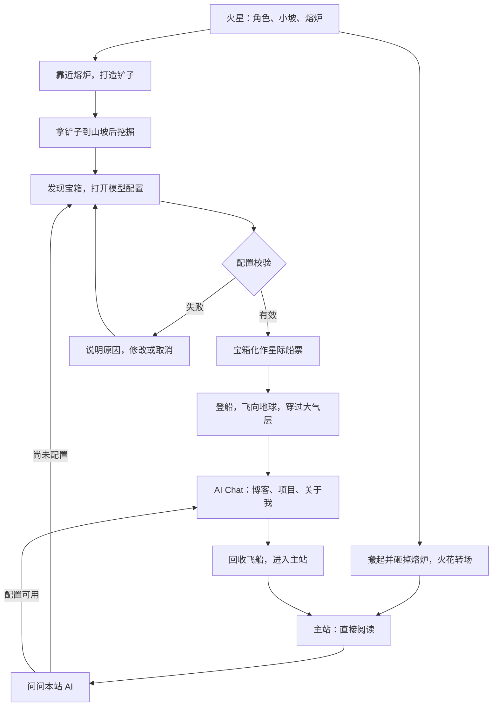

> 历史提案提示：用户随后明确“就用这个吧”，主题已选定。现行内容见[完整体验方案 v1.0](experience-spec-v1.0.md)，下文保留当时待确认语境。

# 火星探索与 AI 船票 · 体验提案

> v0.1 · 2026-09-16 · 用户提供的具体场景，尚未确定是否作为最终主题；不代表整阶段批准。
> 已明确的新需求：访客使用 AI 搜索/问答前配置自己的模型厂商、API Key 和模型。下面把用户提出的情节与补充建议分开。

## 场景与两条路线

用户描述：火星表面，远处小坡，近处熔炉和可操控的男生。角色可移动、炼铁打造铲子；到山坡后挖出宝箱。宝箱弹出模型配置，完成后化为星际船票；角色乘飞船去地球，穿过大气层后出现 AI Chat，能询问本站公开博客、项目和站长信息。

另一条用户提出的路线：不打造铲子，搬起熔炉砸掉，火花溅出，直接进入主站。AI Chat 中也能通过回收火箭/飞船进入主站。

“主站重新打开 AI”的支路是补充建议，避免砸炉选择永久关闭问答。主站的视觉与布局仍需设计；不能据此默认恢复旧证据桌。

## 关键镜头与动作

| 节点 | 用户情节 | 补充设计建议（待评审） |
|---|---|---|
| 初次落地 | 男生站在熔炉前，远处小坡 | 在场景内简短说明身份；显示移动与交互提示。精简背包、血条等无关游戏界面 |
| 打造 | 熔炉炼铁，制成铲子 | 首轮原型让炉边已有少量可用原料，免去额外采矿任务；一次打造即可得到铲子，角色姿态明确变化 |
| 找到坡后 | 拿铲子挖东西 | 脚印、土壤痕迹或微光提示可挖处；不靠随机坐标或长时间试错；镜头能看到坡后 |
| 宝箱 | 挖出后弹出配置 | 先呈现开箱，再打开稳定可读表单，场景暂停移动输入；焦点进入表单，关闭后返回箱旁 |
| 船票 | 配置完成化作船票 | 船票只展示厂商、模型等非秘密摘要，不显示或编码 Key；连接验证成功后才可起飞 |
| 地球 | 乘飞船穿过大气层，打开 Chat | 转场与配置成功是两个状态；可跳过飞行直接到 Chat，不因动画失败要求重新填 Key |
| 砸炉 | 搬起熔炉、砸掉、溅射火花 | 靠近时明确提供“打造铲子 / 砸炉进入主站”两项；不用让访客猜隐藏手势；砸炉不代表删除网站内容或账号 |
| 回收 | 回收飞船进入主站 | Chat 的退出按钮可写“回收飞船 · 浏览主站”；收起窗口再做短过渡，保留本次会话，飞船可再次展开为 Chat |

以上原料、提示、表单暂停、跳过飞行与会话保留均是 Agent 提案；没有被写成用户已批准细节。不会把角色认定为站长本人或据此虚构外貌。

## 模型配置：把必要步骤说清楚

用户明确要求厂商、API Key、模型等必要信息。配置是使用 AI 的前置条件，普通阅读与普通关键词查找不需要 Key。

建议字段与行为：

- 厂商：选定后展示相应配置项。支持哪些厂商待方案阶段确认，不先承诺“所有模型均可用”。
- API Key：默认遮罩，可临时显示；不出现在船票、网址、分享链接、分析事件、日志或错误详情中。
- 模型：选择或填写可用模型；模型列表无法获取时可手动输入。存在但无权限、不支持所需请求与未知模型分别反馈。
- 接口地址：仅当所选接入方式需要时展示；明确请求目的地。预置厂商与自定义地址的支持范围尚待确认。
- 验证按钮：用“验证配置并生成船票”，说明会向所选服务发起验证，若产生调用费用由访客自己的账户承担；不要每次改一个字符就发请求。
- 保存偏好：提案默认仅本次会话可用，不默认长期保存。持久保存、清除方式、请求是否经本站服务器等在 G3 明确，不能在方案未知时承诺“Key 绝不经过服务器”。

用户需能看清问题及用于回答的公开内容会送给哪个模型服务。访客 Key 只用于该访客问答，不用于站长管理、其他访客或后台任务。站长 Agent 的凭据与配置独立，本轮没有更改它的来源。

### 状态与返回

| 状态 | 页面反馈与下一步（提案） |
|---|---|
| 未填完整 | 具体指出缺少字段；保持表单，不生成船票 |
| 正在验证 | 可取消；防止重复提交；不把等待当作成功 |
| Key 无效 / 模型不可用 | 分别提示，保留非秘密配置，允许改正；错误文本不得回显完整 Key |
| 余额不足 / 限流 / 网络失败 | 保留探索进度，可重试、换配置或直接浏览主站 |
| 取消开箱配置 | 回到宝箱旁；另有进入主站路径；不用重新打造或挖宝 |
| 验证有效 | 生成船票，进入飞行；飞行动画失败仍可进入 Chat |
| 使用中失效 | 保留当前问题和已有对话，重新配置；无需重复探索 |
| 清除配置 | 停止使用该 Key；需要 AI 时重新配置，普通阅读继续可用 |

完整来源引用、无资料不编造、只访问公开内容等沿用 PRD。自带 Key 不会扩大访客权限，也不会让网站私有资料进入回答。

## 可达性与重访（补充建议）

首次探索提供趣味，也保留清晰的“直接浏览主站”和“直接配置 AI”入口。手机使用触控移动/交互，键盘可完成核心路径；减少动效或 3D 加载失败时以普通页面完成相同选择。重访不强制重复炼铁、挖宝与飞行。

是否默认重访进主站、是否记住探索进度、精确动作和镜头时长均待原型评审，不在这里锁定。

## 下一份原型如何验证

先演示一条完整链：移动 → 打造 → 挖宝 → 模拟配置失败/成功 → 船票 → 飞行 → Chat → 回收进主站；再演示砸炉直入主站和从主站重新打开 AI。手机和减少动效另有可用路径。

原型只允许示例厂商、假 Key、预设回答，显著标注模拟；不要邀请用户输入真实密钥或调用真实模型。真实 Key 的接入、传输、保护、费用与权限验证在工程阶段执行。

当前仍需明确的是：这个火星故事是要继续细化的主题，还是用于表达探索结构的例子。已有异步问题等待用户回复；未答复前不宣称选定火星主题，不开始制作新原型。
