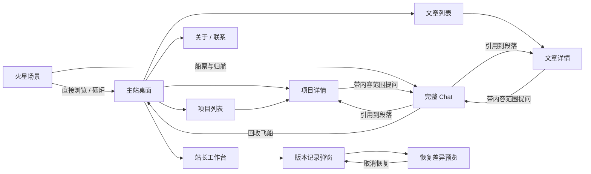

# 页面关系与返回核查 · v1.1.3

2026-09-16，G2 原型内修订。用户要求逐一核实页面之间的逻辑关系；“很好”不是整阶段验收。

## 规则

“← 返回…”回到本次访问中实际进入当前页的上一页，不新增一条反向历史，因此不会在两页间反复打转。按钮文字显示来源名称。没有可确认的站内来源（直接打开、刷新后），详情回所属列表，其余回主站，不把用户送出本站。

“前往主站”“前往火星”“回收飞船 · 浏览主站”是固定目的地，不冒充历史返回。顶部品牌和主站火星按钮已经使用“前往”措辞。导航栏中的项目/文章/关于/联系是切换栏目。

图中连线代表入口，不代表所有返回都固定走反向栏目。真实返回依据历史来源，例如首页直接打开项目，返回首页；从项目列表打开同一项目，返回项目列表。

## 核查矩阵

| 页面/入口 | 返回、关闭或取消的目的地 | 保留内容 | 本轮证据 |
|---|---|---|---|
| 首页→项目详情 | 首页 | 首页滚动位置 | 浏览器已走通 |
| 项目列表→详情 | 项目列表 | 筛选词、滚动位置 | 浏览器筛选“线索”往返，筛选保留；前进可重进详情 |
| 文章列表→文章详情 | 文章列表 | 筛选词、滚动位置 | 浏览器已走通文章列表→详情→返回 |
| Chat→引用文章/项目 | 原 Chat 历史项 | 消息、未发送问题、对话滚动位置 | 浏览器引用到 section-1 后返回，消息与草稿仍在 |
| 详情→Chat | 来源详情 | 原详情浏览位置 | 浏览器从项目进入 Chat 再返回项目 |
| 直接打开带锚点文章 | 文章列表 | 正确定位段落；不虚构对话来源 | 独立标签页已走通，不显示“返回对话” |
| 关于→联系→工作台 | 返回逐级来源 | 阅读/草稿视图 | 浏览器联系→返回关于→返回主站已走通，工作台来源按钮已核对 |
| 配置取消/关闭/Esc | 原页面 | 当前内容、场景进度 | 项目页打开后 Esc，仍在原项目 |
| Chat 内重新配置 | 当前 Chat | 会话不换成船票流程 | 已直接配置并进入 Chat；新文案明确目的地 |
| 清除配置 | 主站，地址同步 home | 演示消息留在本次访问内，再次进 Chat 需配置 | 浏览器已走通；后退出现可退出的配置前置页 |
| 直接打开未配置 Chat | 配置前置页，可返回/前往主站 | 不出现 URL 为 Chat、画面为主站的错配 | 已检查关闭配置后的前置页 |
| 工作台→其他页→工作台 | 原工作台状态 | 输入、待确认提案或执行结果 | 浏览器实际往返检查输入、提案、发布结果 |
| 工作台→版本记录 | 关闭回工作台 | 输入和提案 | 已走通 |
| 版本记录→恢复预览 | “取消恢复，返回记录” | 原版本号不变 | 已走通，仍为模拟 v2 |
| 无效路由/内容 | 明确“前往主站” | 无虚构来源 | 浏览器无效路由→前往主站已走通；缺失内容同一固定入口 |
| 归航完整/跳过/重看 | 完整 Chat | 当前会话 | 复用既定目的地，重看不添加假历史项 |
| 重返火星 | 火星；已完成旅程时重置探索 | 模型演示配置和 Chat 保留 | 固定目的地，与历史返回区分 |

## 具体修复

1. 详情原先总回栏目列表，现按来源返回。
2. 锚点原先一律出现返回 Chat，现只有真实 Chat 来源显示。
3. 引用原先使用原生 hash 跳转、按钮用另一套逻辑，现普通左键统一进入历史管理；新标签页/修饰键行为保留。
4. 清除配置、未配置 Chat 原先画面与 URL 不一致，现保持一致并提供出口。
5. 工作台重绘原先丢失提案展示，执行回调还依赖是否停留工作台；现结果状态独立保存，回到工作台再呈现。未新增真实写入。
6. 恢复预览取消原先关闭整个弹窗，现回版本记录。

## 验证与边界

纯逻辑测试覆盖返回/前进、引用多级链路、直达链接安全回退；浏览器检查与未单独实测的项在表内区分。本次只保留会话内状态，刷新后的跨会话历史来源不会猜测；消息与工作台数据仍为模拟。移动端复用同一路由，未新增声称真实手机全量验收。
