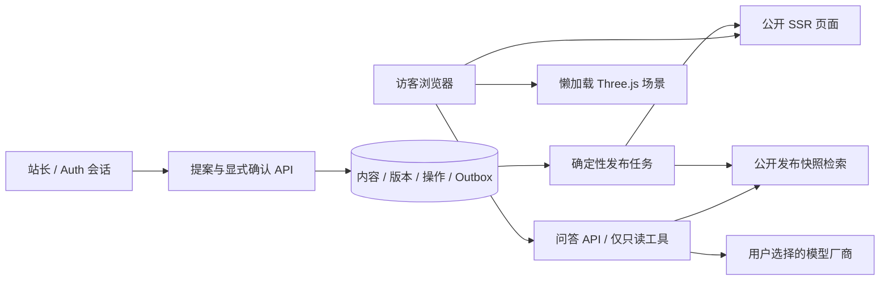

# 技术实现方案

> v1.0 · 2026-09-17 · G3 待评审。基线：PRD、功能设计、用户认可的原型 v1.1.6（Sites 版本 8）。以下均为工程提案，尚未实施或锁定费用。

## 1. 交付目标与边界

首版同时包含公开个人站、可跳过的火星体验、访客 BYOK 问答、站长内容管理 Agent。只做展示站不能视为首版完成。当前可复用的是视觉、素材和纯逻辑；定时器回答、内存发布、模拟登录必须替换。姓名黄凌波已获授权，其余真实个人内容与社媒链接待提供。

## 2. 推荐架构

采用 TypeScript 单仓库、Next.js App Router + React、原生 CSS 设计令牌、Three.js 独立场景模块；Supabase 托管 PostgreSQL、Auth 和 Storage。用 Zod 校验边界，SQL migration 管理表结构，Vitest 验证纯逻辑，Playwright 验证端到端路径。具体版本在 G4 第一个任务核对官方支持并锁进 lockfile，不在本方案写“最新版”作为依赖。

原因：一个主语言覆盖界面和服务端，公开内容可服务端渲染，保持源码学习成本可控；数据库、登录、素材统一托管，避免首版自行维护账号系统。保留标准 Node 部署出口，不把 Sites 原型托管误当成正式后端方案。[Next.js 支持 Node 自托管及流式响应](https://nextjs.org/docs/app/guides/self-hosting)。生产托管建议先选支持 Node 的托管平台，域名、区域、预算由用户评审后确定。

不引入首版不需要的微服务、多 Agent 调度、独立向量数据库或 Kubernetes。Supabase 只是推荐，不已购买；若实际网络/区域或成本不适用，在 M0 做一次替代评审，而非同时维护两套实现。

## 3. 建议代码组织（G4 才创建）

- `src/app/`：公开路由 `/`、`/projects/[slug]`、`/notes/[slug]`、`/about`、`/social`、`/contact`、`/chat`、`/explore`；管理路由 `/admin` 及 API。
- `src/features/content/`：正文结构、编辑式排版、稳定段落标识。
- `src/features/scene/`：场景状态机、角色握持、地形碰撞、镜头与资源生命周期。
- `src/features/chat/`：消息、引用、供应商选择、取消、错误恢复。
- `src/server/{content,retrieval,providers,admin,jobs}/`：不同权限域，访客模块不得导入管理执行工具。
- `supabase/migrations/`、`tests/{unit,integration,e2e,eval}/`、`public/assets/`。
- `prototype/` 为已认可设计参照，不直接演变成含秘密的生产服务端；`docs/`、`tasks/`、`learn/` 继续保留。

公开页面先可阅读，场景只在进入探索后下载。SSR 不导入 WebGL；离开场景停止渲染，销毁监听器和 GPU 资源。慢网/WebGL 失败/减少动效可直接进入主站或 Chat。现有 terrain、motion、shortcuts、flight-sequence 的纯逻辑和测试逐项迁移；不整体照搬 app.js 的共享可变状态。

## 4. 内容、检索和版本模型

正文使用经过 schema 校验的块数组：heading、paragraph、image、quote、code、diagram。每块拥有 UUID，修改文字不更换 ID；禁止执行用户提供的 MDX/JS/原始脚本。渲染组件决定排版，正文数据不混入任意 HTML。文章与项目使用不同模板，维持当前设计。

| 表 | 关键字段与约束 | 用途 |
|---|---|---|
| content_items | id, type, slug(unique), draft_revision_id, published_revision_id, lock_version | 内容身份及草稿/公开指针 |
| content_revisions | id, item_id, revision_no, schema_version, blocks(jsonb), hash, author_id, created_at | 不可变完整快照，unique(item_id, revision_no) |
| publication_releases | id, previous_id, state, manifest(jsonb), index_version, created_at | 一次公开内容集合，manifest 固定每项 revision |
| site_state | singleton id, active_release_id | 页面与问答共用的原子发布指针 |
| search_chunks | release_id, item_id, revision_id, block_id, text, tokens | 可追溯到具体段落，只收录该 release 公开材料 |
| proposals | id, actor_id, target_id, base_version, patch, patch_hash, expires_at, status | 供人检查的变更提案 |
| operations | id, proposal_id(unique), idempotency_key(unique), steps, status | 写入执行与结果查询 |
| outbox_jobs | id, operation_id, kind, payload_ref, attempts, next_run_at, lease_until | 事务外任务重试，唯一去重键 |
| social_links / site_profile | platform, approved_url, label / approved public fields | 真实身份与已批准渠道 |
| assets | id, object_key, mime, size, alt, license, owner_id | 受控上传，保持素材许可 |

数据库开启 RLS；匿名只读 active release 投影，不能读草稿/提案/审计。管理员由服务端固定用户 ID 白名单判定，不能由请求里的 `role` 决定；每次写操作验证会话和权限。高权限服务密钥仅服务端使用，其绕过 RLS 的能力必须通过应用层检查约束。[Supabase 的权限机制说明](https://supabase.com/docs/guides/database/secure-data)。

首版小型中文站采用确定性检索：标题、标签、段落关键词；Unicode 规范化 + 中文分词/二元词组合，固定权重排序，使用公开语料评估集调权。Top-k 及上下文 token 上限可配置，找不到证据就不调用模型编答案。达到评估线后可发布，不以向量技术本身作为目标。若中文语义召回不足，增加固定站长 embedding 模型 + pgvector 的混合检索；不得用不同访客模型生成互不兼容的索引。[pgvector 可配合 RLS](https://supabase.com/docs/guides/ai/rag-with-permissions)。此增强需记录索引费用与回填计划。

## 5. 访客自带 Key：明确的数据通路

建议：浏览器内存持有 Key，每次调用通过 HTTPS 发送给本站问答代理；代理仅在请求生命周期使用，转发到选定厂商，不写数据库、日志、分析系统或 URL。它**会经过本站服务端**，不能宣传“Key 不离开浏览器”。访客提交配置前展示本站与厂商的数据流、所发问题/公开片段、可能的调用费用；拒绝则仍可阅读。

不默认持久化 Key 或聊天记录，不使用 localStorage/sessionStorage 存秘密；刷新后重新配置。Key 清除时取消请求、清空内存引用。JS 无法保证内存物理擦除，不作此承诺。站长使用独立服务端秘密，不能借用访客 Key；站长模型成本由站长承担。

供应商适配接口：validateConfig、streamAnswer、normalizeError、capabilities。首版计划 OpenAI、DeepSeek、Anthropic 三种独立适配；兼容接口仅允许站长预先批准的 HTTPS 目的地，访客可选择但不能让服务器请求任意 baseURL。拒绝 localhost、私网 IP、非 HTTPS、重定向到未批准地址；实际模型名由用户填写/厂商列表校验，不永久写死。

验证使用最小真实请求，明确可能产生少量费用；失败区分 key/model/余额或限流/网络。中断用 AbortController 取消上下游；已经被厂商接受的 token 可能仍计费，停止不等于退款。厂商模型与流式协议在 M0 用官方 SDK 文档与最小请求验证，不能把“兼容”当成所有参数相同。

问答只接收选定范围、当前问题和有长度上限的会话上下文；检索结果作为不可信引用数据，不能改变系统权限。返回 SSE 事件 sources/token/done/error；先建立合法 source ID 集合，只渲染集合内引用。服务端生成引用 URL，不能直接信任模型生成的链接。以发布版本 + 稳定 block_id 定位；内容更新后可显示公开旧版本与“已有新版”提示。撤回内容优先于旧引用可用性，旧链接显示撤回且停止检索。

## 6. 站长 Agent：生成提案与执行分离

站长登录建议 Supabase Auth 的 GitHub OAuth，并在服务端只允许预先登记的站长用户 ID；关闭自助开放注册对写权限的影响，配置 OAuth 回调、CSRF/Origin 校验、HttpOnly 会话 cookie。仓库属于 adu-works 不等于任何 GitHub 用户都能管理站点。

模型仅调用只读 `getContent` / `searchContent` 与生成结构化 patch 的 `proposeChange`。确定性执行器负责写入；模型看不到数据库密钥、部署 token、shell、邮件或任意 HTTP 工具。提案显示目标、来源、逐字段差异、预览、影响页、基础版本、有效期；人按确认按钮才提交执行。

执行时再次鉴权，校验 proposalId、patch_hash、base_version 与未过期状态；在一个事务里锁定内容行、写新 revision、登记 operation/outbox。数据库唯一约束保证同一确认只执行一次。冲突返回 409，不自动覆盖；取消或过期提案不能执行。

发布任务先构建 release 与检索快照，检查通过后原子切换 active_release_id，再触发页面缓存刷新。UI 分别显示“草稿已保存 / 发布已生效 / 索引就绪”；失败前旧 release 继续服务，不能出现新页面引用旧索引。缓存刷新失败单独显示待同步、重试同一任务，客户端按 releaseId 防止混用。前台请求按快照读，避免发布过程中跨版本读取。

请求断开显示结果待核实，查询 operationId，不能盲目重复发布。恢复也是新提案→差异→确认→新 revision/release，不删除历史。任务租约过期可接管，最大重试后进人工处理队列。初始任务用 PostgreSQL outbox 与独立 Node worker，不引入 Redis 前置依赖。

## 7. 运行约束与待评审项

建议起始限制：单问题 4,000 字、会话输入总量 12k tokens、答案最多 2k tokens、每会话一个并行请求；60 秒上游超时。匿名会话与 IP 分层限流（共享数据库原子计数，TTL 清理），避免用 Key 作为可记录的限流标识。最终阈值随实际预算和压测调整。

待批准：①推荐技术栈与托管区域；②访客 Key 经过本站但不持久化；③供应商列表与自定义端点白名单；④正文块与发布快照模型；⑤预算及上线域名。未确认真实内容不阻止工程设计，但阻止假装真实内容已经上线。

费用由应用托管、数据库/存储、出站带宽、站长模型与可选 embedding 构成；访客自带 Key 只覆盖其厂商调用，不意味着网站运行零成本。不填写未核验套餐价格。预算确认后做月度上限、告警和降级设置。

参考核对日期：2026-09-17。技术选型是本项目判断，引用仅证明相关平台能力，不表示已完成部署。
